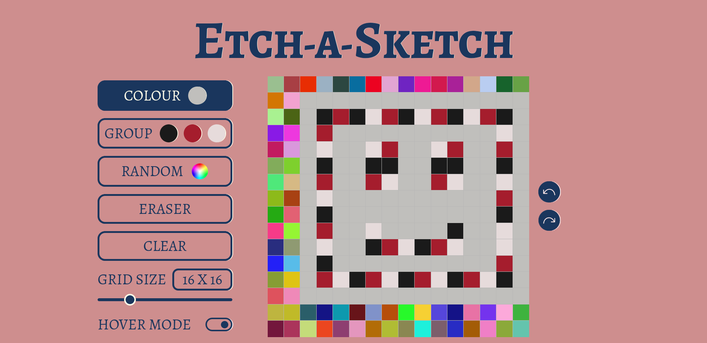
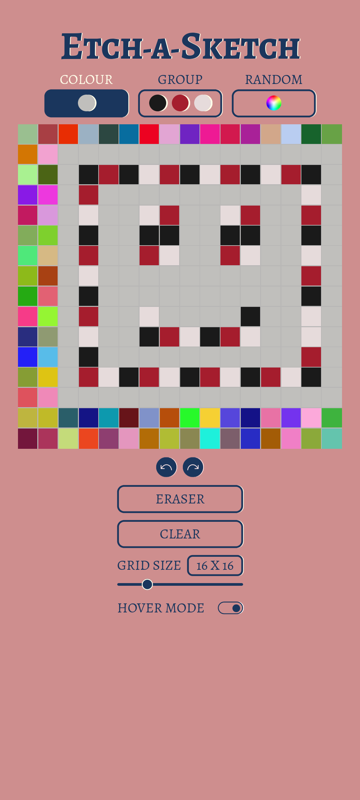

# Etch A sketch

Browser version of something between a sketchpad and an Etch-A-Sketch.

Link: https://dev-spectre.github.io/etch-a-sketch/

This webpage was built to practice DOM manipulation in Javascript.

## Note

This was my second attempt to make a responsive website, it looks as intended for most screens except some laptop screens.

## Features

**Colour**: Single colour mode, you can change colour by clicking the circle which has colour.  
**Group**: Multi colour mode, switchs between the three colours you have chosen.  
**Random**: Selects a random colour each time you colour a grid.  
**Eraser**: Erase the mistakes you have made.  
**Clear**: Cleans the entire grid space allowing you to start from beginning.  
**Grid size**: Change the size of grid using the slider. (min=2x2, max=64x64, default=16x16).  
**Hover mode**: Allows you to colour the grid by just hovering the mouse above the grid or dragging your fingers across the grid in touchscreens.  
**Undo/Redo**: Go few steps back or ahead.  

## Preview

### Desktop

### Mobile

